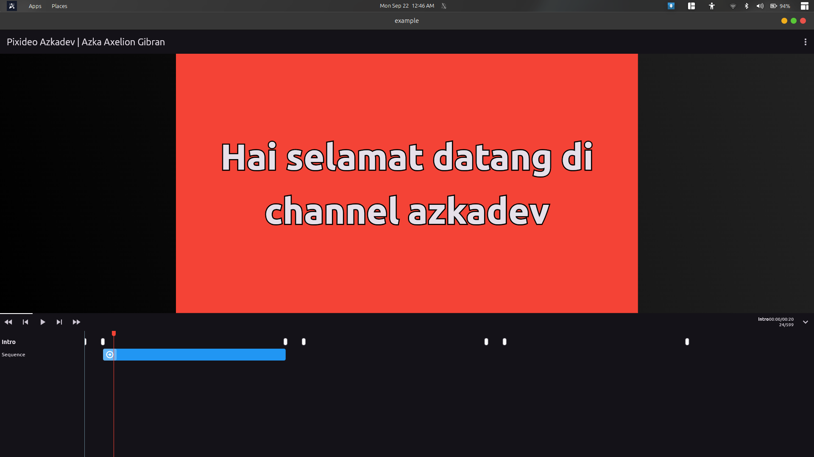
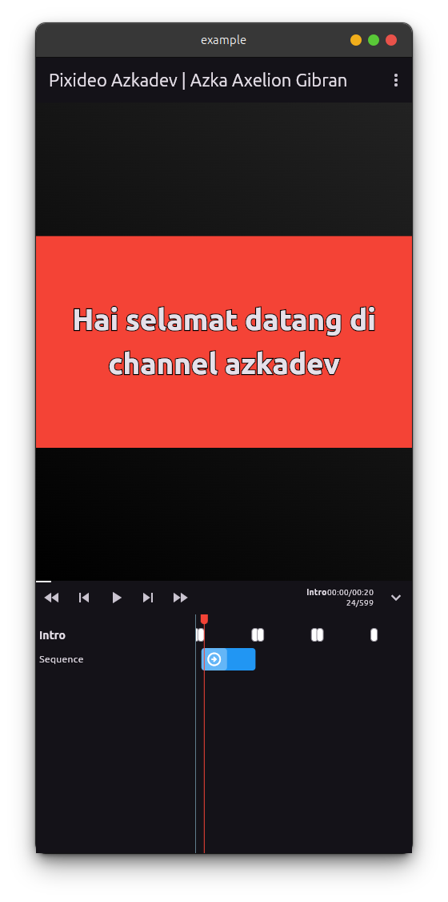
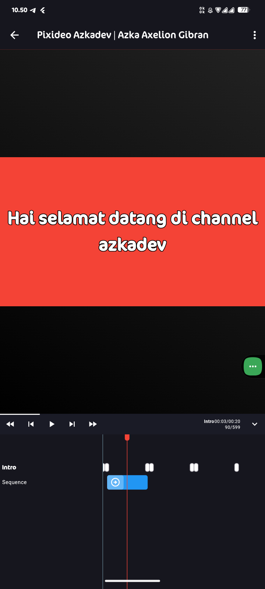
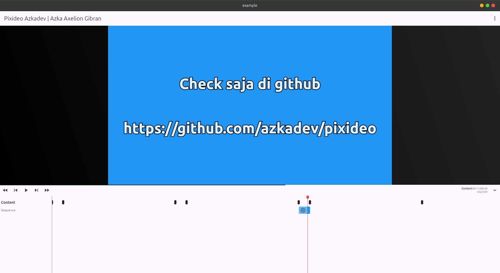

 # Pixideo


saya memiliki sedikit waktu jadi untuk sementara saat ini fitur terbatas, dan pada dasarnya support cross platform akan tetapi untuk web mungkin perlu perubahan saat render kalopun hanya preview ya bisa saja

- 🇮🇩 [Indonesia](./README.md)
- 🇺🇸 [Inggris](./README_EN.md)
- 🇰🇷 [Korea, Republic of South Korea](./README_KO.md)
- 🇨🇳 [China](./README_zh-CN.md)
- 🇿🇦 [South Africa](./README_AF.md)
- 🇮🇳 [India](./README_HI.md)
- 🇯🇵 [Japan](./README_JA.md)
- 🇷🇺 [Russia](./README_RU.md)
- 🇹🇭 [Thailand](./README_TH.md)
- 🇦🇪 [United Arab Emirates](./README_AR.md)

Demo Video: https://youtu.be/Vh2gAUV0guA


| 1                        |
|--------------------------|
|  |


| desktop                        | mobile                        |
|--------------------------------|-------------------------------|
|  |  |


| 1                        |
|--------------------------|
|  |


- Rendering Built In Support
  - [x] Android
  - [x] Linux

import

```dart
import 'package:pixideo/pixideo.dart';
```


```dart

  final controller = PixideoController();

  @override
  Widget build(BuildContext context) {
    final content = Composition(
      fps: 30,
      duration: const Time.duration(
        Duration(seconds: 20),
      ),
      width: 1920,
      height: 1080,
      //
      // width: 1080,
      // height: 1920,
      child: const ContohSederhanaScene(),
    );
    return PixideoWidget(
      controller: controller,
      composition: content,
      projectName: "video_sintetis_azkadev",
      directoryProject: Directory(
        path.join(
          Directory.current.path,
          "temp",
          "pixideo",
          "generated",
        ),
      ),
    );
  }
```


jika sumber icon pack ada pembaruan buat saja issue di github biar saya update / kamu yang coba update


Author: https://github.com/azkadev

repository: https://github.com/azkadev/pixideo

22-september-2025# pixideo
