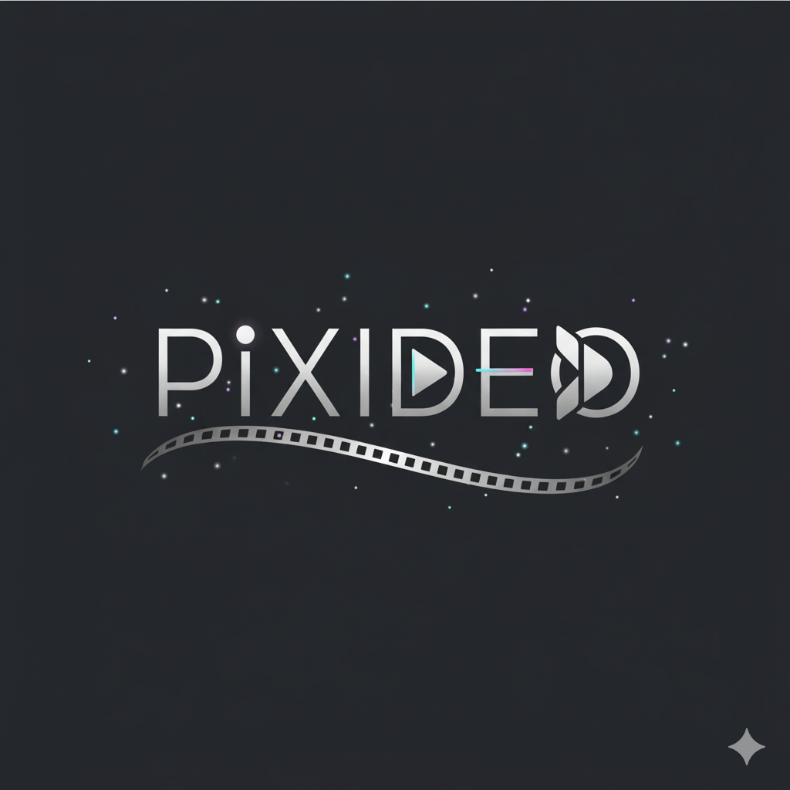

# Pixideo



I'm short on time, so for now, the features are limited. It's basically cross-platform support, but for the web, rendering might need to be changed, even if it's just a preview.

- 🇮🇩 [Indonesia](./README.md)
- 🇺🇸 [English](./README_EN.md)
- 🇰🇷 [Korea, Republic of South Korea](./README_KO.md)
- 🇨🇳 [China](./README_zh-CN.md)
- 🇿🇦 [South Africa](./README_AF.md)
- 🇮🇳 [India](./README_HI.md)
- 🇯🇵 [Japan](./README_JA.md)
- 🇷🇺 [Russia](./README_RU.md)
- 🇹🇭 [Thailand](./README_TH.md)
- 🇦🇪 [United Arab Emirates](./README_AR.md)

Demo Video: https://youtu.be/Vh2gAUV0guA


| 1 |
|--------------------------|
|  |


| desktop | mobile |
|--------------------------------|---------------------------------------------|
|  |  |


| 1 |
|--------------------------|
|  |


import

```darts
import 'package:pixideo/pixideo.dart';
```


```darts 

final controller = PixideoController(); 

@override 
Widget build(BuildContext context) { 
final content = Composition( 
fps: 30, 
duration: const Time. duration( 
Duration(seconds: 20), 
), 
width: 1920, 
height: 1080, 
// 
// width: 1080, 
// height: 1920, 
child: const SimpleExampleScene(), 
); 
return PixideoWidget(
controller: controller,
composition: content,
projectName: "video_sintetis_azkadev",
directoryProject: Directory(
path.join(
Directory.current.path,
"temp",
"pixideo",
"generated",
),
),
);
}
```

If there's an update to the icon pack source, just create an issue on GitHub so I can update it or you can try updating it.

Author: https://github.com/azkadev

repository: https://github.com/azkadev/pixideo

September 22, 2025 # pixideo